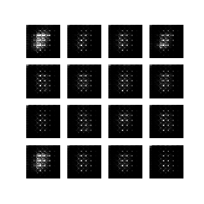

# MNIST Deep Convolutional Generative Adversarial Network (DCGAN)

## Background
My first attempt at TensorFlow 2.0 and GAN by experimenting with TensorFlow's [tutorial](https://www.tensorflow.org/alpha/tutorials/generative/dcgan).

## Setup & Installation
Follow [Fast.ai's guide](https://course.fast.ai/start_gcp.html) to set up a Google Cloud Platform (GCP) instance to run the notebooks in the repo.

## Training & Evaluation
Run `mnist-dcgan.ipynb` to train and evaluate the model.
